# Table Of Contents
- [Introduction](#introduction)
- [Background](#background)
- [Installation](#installation)
  - [Download pre-built binaries](#download-pre-built-binaries)
  - [Installing using Homebrew on Mac/Linux](#installing-using-homebrew-on-maclinux)
    - [Install](#install)
    - [Upgrade](#upgrade)
    - [Uninstall](#uninstall)
    - [Remove the tap](#remove-the-tap)
- [Preparing an Ente Auth export](#preparing-an-ente-auth-export)
  - [Export codes](#export-codes)
- [Usage](#usage)
  - [Options description](#options-description)
- [Features](#features)
  - [Display live 2FA codes](#display-live-2fa-codes)
  - [Filtering](#filtering)
  - [Plaintext export (not recommended)](#plaintext-export-not-recommended)
  - [Export 2FA QR Codes to PNG files (not recommended)](#export-2fa-qr-codes-to-png-files-not-recommended)
  - [QR codes in the terminal (recommended)](#qr-codes-in-the-terminal-recommended)
  - [Screenshots of demo QR code](#screenshots-of-demo-qr-code)
    - [iTerm2](#iterm2)
    - [Apple Terminal](#apple-terminal)
    - [Windows PowerShell](#windows-powershell)
  - [Show 2FA secret QR Code](#show-2fa-secret-qr-code)
- [Tested Terminals](#tested-terminals)
- [Encrypting files](#encrypting-files)
- [Latest Version (v1.0.1)](#latest-version-v101)
- [Testing](#testing)
  - [Running tests](#running-tests)
- [FAQ](#faq)
  - [Why did Apple Terminal.app resize when displaying a QR Code?](#why-did-apple-terminalapp-resize-when-displaying-a-qr-code)
  - [Why is the QR code distorted over ssh from Apple Terminal.app?](#why-is-the-qr-code-distorted-over-ssh-from-apple-terminalapp)
  - [How can I try the CLI without a real Ente Auth export?](#how-can-i-try-the-cli-without-a-real-ente-auth-export)
  - [Can I use the CLI without a real encrypted Ente Auth export?](#can-i-use-the-cli-without-a-real-encrypted-ente-auth-export)
  - [Why did Windows block the binary with "An Application Control policy has blocked this file"?](#why-did-windows-block-the-binary-with-an-application-control-policy-has-blocked-this-file)
  - [Why did I not abandon Ente Auth after the bug that motivated this CLI?](#why-did-i-not-abandon-ente-auth-after-the-bug-that-motivated-this-cli)
- [License (MIT)](#license-mit)
- [Credits](#credits)


# Introduction

* `twofa-rescue` is a cross-platform command-line tool to decrypt [Ente Auth](https://ente.com/auth/)
encrypted export files and generate live 2FA codes on a terminal.

* It can also display QR codes of your 2FA secrets in the [Terminals](#tested-terminals) (recommended),
or export them as PNG files (not recommended) or a text file with TOTP URLs
(not recommended), so you can import them into other authenticator apps.


**Note:** This tool only decrypts encrypted export files from [Ente Auth](https://ente.com/auth/),
which is the authenticator app I currently use.


I created it when [Ente Auth](https://ente.com/auth/) stopped working (continuous spinning circle)
after upgrading my iPhone.

Hope you find it useful as well.


# Background

I used [Google Authenticator](https://apps.apple.com/us/app/google-authenticator/id388497605) app on iOS for a long time. At some point in
past there was speculation that google might discontinue it. I looked
around for an open source alternative, reviewed the code, and moved to
[Ente Auth](https://ente.com/auth/). I do not store my authentication data in the cloud. Instead,
I periodically export an encrypted backup and keep copies on several
systems.

After getting a new iPhone (iOS v26.6), [Ente Auth](https://ente.com/auth/) stopped
working and continuously displayed a spinner forever. Updating the app did not help, and
importing my encrypted backup failed too. I had backups, but no independent
way to restore them.

**This CLI was created to make sure that I will never be dependent on a
single mobile app, or be in trouble if I lose my phone.**

It follows Ente's documented export format in [Exporting your data out of Ente Auth](https://ente.com/help/auth/migration/export). I am
also the author of [libsodium-jna](https://github.com/muquit/libsodium-jna), so the underlying crypto methods were
familiar.

**Update:** After deleting and re-installing the [Ente Auth](https://ente.com/auth/) app, it was able
to import the encrypted JSON file from the old phone.


# Installation

## Download pre-built binaries

* Download pre-built binaries from [releases](https://github.com/muquit/twofa-rescue/releases) page.

* To compile from source, please look at [Build from source](#build-from-source)

## Installing using Homebrew on Mac/Linux

You will need to install [Homebrew](https://brew.sh/) first.

### Install

```
brew tap muquit/twofa-rescue https://github.com/muquit/twofa-rescue.git
brew install muquit/twofa-rescue/twofa-rescue
```

### Upgrade
```
brew upgrade twofa-rescue
```

### Uninstall
```
brew uninstall twofa-rescue
```

### Remove the tap
```
brew untap muquit/twofa-rescue
```

<hr width="200" align="left">

<sub>Brew install instructions and formula automatically generated by [go-xbuild-go](https://github.com/muquit/go-xbuild-go) v1.0.12 on Aug-27-2026</sub>

<sub>[go-xbuild-go](https://github.com/muquit/go-xbuild-go) writes the formula into the project's own `Formula/project.rb` rather than a central Homebrew tap repo. This keeps the formula version-controlled and committed alongside the code.</sub>

<hr width="200" align="left">


# Preparing an Ente Auth export

If your Authenticator app is other that [Ente Auth](https://ente.com/auth/), install it first. But
before that, check [Ente Auth import list](https://ente.com/help/auth/migration/import) to make sure your Authenticator app is in the
list. **If your Authenticator is not in the import list, then you cannot use `twofa-rescue`
without some work.**. Please look at FAQ for workaround.

To find the installed Ente Auth version on an iPhone, open **Settings**, then
go to **General > iPhone Storage > Ente Auth**. The version is displayed below
the app name.

The following screenshot shows the import formats supported by Ente Auth 4.4.25.

<p align="center">
    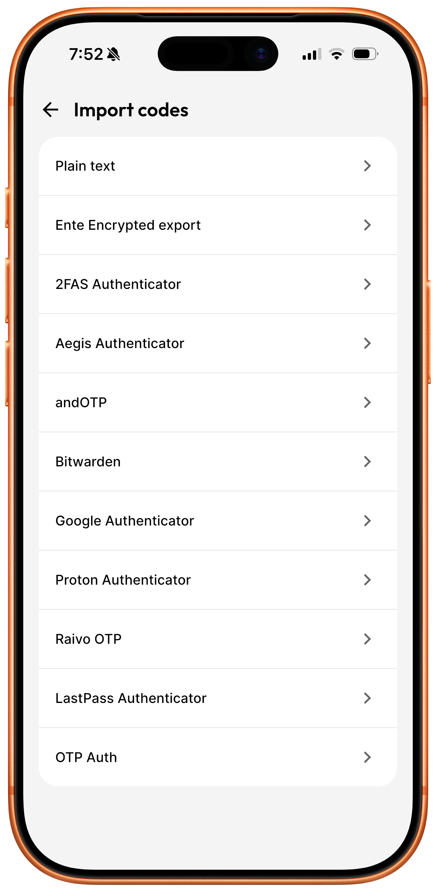 
</p>


`twofa-rescue` requires an encrypted export file from [Ente Auth](https://ente.com/auth/) and the
password used to create it.

<table>
    <tr>
        <td align="center">
            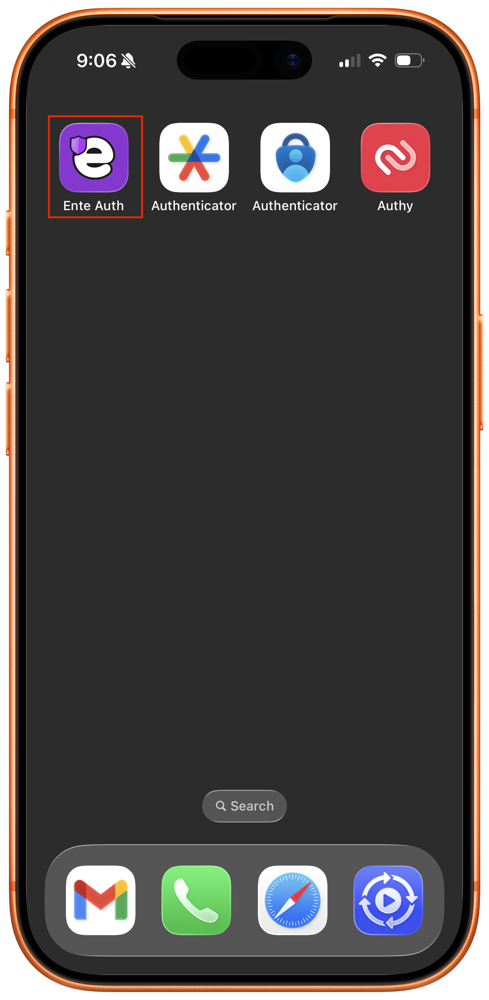<br>
        </td>
        <td align="center">
            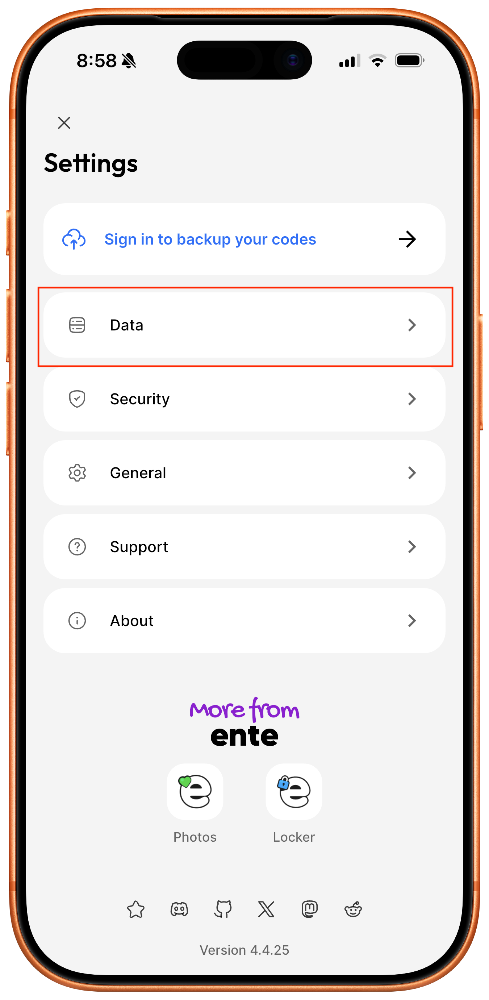<br>
        </td>
    </tr>
</table>


* Open [Ente Auth](https://ente.com/auth/), then tap the hamburger menu icon in the upper-left corner to open
  Settings.

* Tap **Data**.

After importing your codes, return to the **Data** screen and export your
secrets to an encrypted JSON file.

## Export codes

The following screenshots show how to create an encrypted export on an
iPhone using Ente Auth 4.4.25. Menu names and locations may differ in other
versions.

<table>
    <tr>
        <td align="center">
            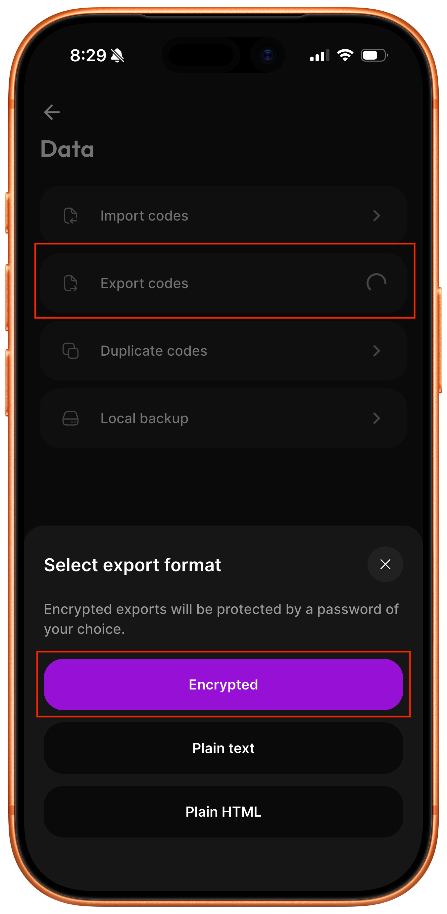<br>
        </td>
        <td align="center">
            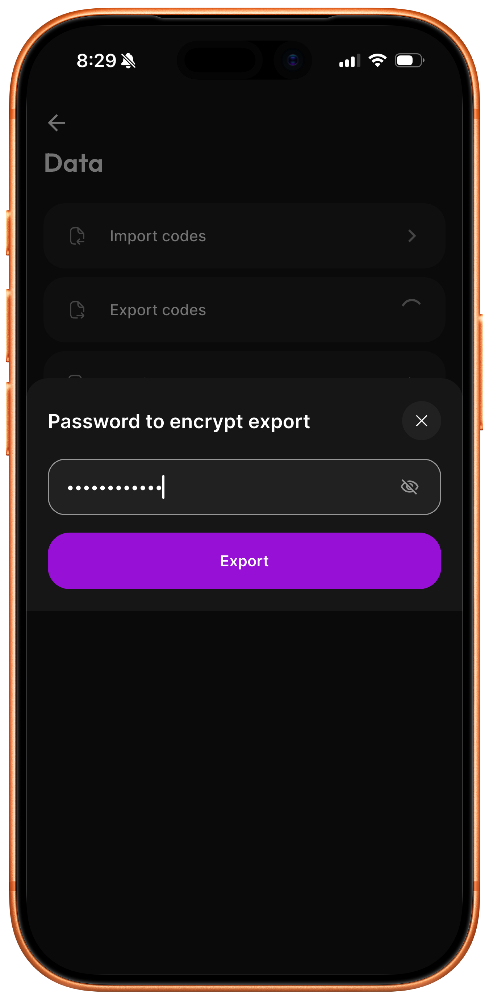<br>
        </td>
    </tr>
</table>

* Tap **Export codes**, then select **Encrypted**.

* Enter a strong password, then tap **Save**.

Save the file on your phone, then transfer it to the computer where you will
run `twofa-rescue`. For example, you can save it to local iPhone storage and
use AirDrop to transfer it to a Mac. Use the equivalent export and transfer
steps for [Ente Auth](https://ente.com/auth/) on other platforms.

Use `twofa-rescue` to display live 2FA codes or show QR codes for importing
entries into another authenticator app. See [Usage](#usage) for the available
commands.

Create a new encrypted export whenever you add, remove, or change a 2FA entry,
and keep backup copies in safe locations.

_The screenshots are framed with [iphone-frameit](https://github.com/muquit/iphone-frameit)_


# Usage

Set the [Ente Auth](https://ente.com/auth/) export password in `TWOFA_RESCUE_PASS` first:
```
  export TWOFA_RESCUE_PASS='password'
```

Tip: if your shell has `HISTCONTROL=ignorespace` set (the default in many
bash setups), type a single leading space before the `export` command to
keep the password out of your shell history.

<!-- BEGIN GENERATED USAGE: DO NOT EDIT BY HAND, run scripts/gen_usage.sh -->
```
Version: @($) twofa-rescue v1.0.1
https://github.com/muquit/twofa-rescue
Compiled with go version: go1.27.0

Usage: twofa-rescue [options] [export-file] [filter]

Arguments:
  [export-file]  Ente Auth encrypted export JSON
  [filter]       Optional issuer or account substring

Options:
  -h, --help         Show help
  -v, --version      Show version
  --decrypt          Print decrypted data instead of codes
  --encrypt          Encrypt any file as an Ente Auth export
  -o <file>          Write --decrypt or --encrypt output to a file
  --export-qr <dir>  Save one QR-code PNG per matching entry
  --show-qr          Show matching QR codes one at a time in the terminal
  --demo-qr          Show a non-sensitive test QR code in the terminal
  --debug            Print QR terminal-detection details to stderr

WARNING: QR-code PNGs contain plaintext 2FA secrets. Import them, delete
them, and empty your trash.

Environment:
  TWOFA_RESCUE_PASS  Password for encryption and export operations

  Linux/macOS (bash/zsh):
    export TWOFA_RESCUE_PASS='your-password'

  Windows (cmd.exe):
    set TWOFA_RESCUE_PASS=your-password

  Windows (PowerShell):
    $env:TWOFA_RESCUE_PASS='your-password'

Examples:
  twofa-rescue export_encrypted_json.txt
  twofa-rescue export_encrypted_json.txt github
  twofa-rescue --decrypt -o plain.txt export_encrypted_json.txt
  twofa-rescue --encrypt -o encrypted.json plain.txt
  twofa-rescue --export-qr /path/to/dir export_encrypted_json.txt
  twofa-rescue --show-qr export_encrypted_json.txt
  twofa-rescue --demo-qr

Note: flags must precede the file argument.
```
<!-- END GENERATED USAGE -->

If no filter is specified, codes for all entries are displayed. See
[Display live 2FA codes](#display-live-2fa-codes) for example.

## Options description

| Option | Description |
|---|---|
| `-h`, `--help` | Show this help message and exit. |
| `-v`, `--version` | Print the version and exit. |
| `--decrypt` | Decrypt the export and print the plaintext (`otpauth://` lines) instead of generating codes. |
| `-o <file>` | With `--decrypt`, write the decrypted plaintext to `<file>` instead of stdout. With `--encrypt`, write the encrypted file to `<file>` instead of stdout. |
| `--encrypt` | Encrypt an input file, text or binary (given in place of `<export-file>`), into [Ente Auth](https://ente.com/auth/)'s JSON export format, using the same Argon2id parameters [Ente Auth](https://ente.com/auth/)'s own app uses. Works on any file, not just `otpauth://` lines. |
| `--export-qr <dir>` | Write one QR-code PNG per entry (optionally narrowed by `[filter]`) into `<dir>`, importable one at a time into any authenticator app that supports QR/image upload. **WARNING:** These PNGs contain your 2FA secrets in plaintext. Import them, then delete the files (and empty your trash); do not leave them on disk. |
| `--show-qr` | Display QR codes one at a time in the terminal (optionally narrowed by `[filter]`). Press Enter to advance to the next, or Ctrl+C to quit. Nothing is written to disk. |
| `--demo-qr` | Display a non-sensitive test QR code in the terminal. No export file or password is required. |
| `--debug` | Print terminal-detection diagnostics to stderr when used with `--show-qr` or `--demo-qr`, showing which QR rendering path was chosen and why. |


# Features

## Display live 2FA codes

Can decrypt an [Ente Auth](https://ente.com/auth/) encrypted export file and print the current 2FA
code for each entry.

**Set `TWOFA_RESCUE_PASS` env var with the password first.**  `twofa-rescue -h` for help.
```
 export TWOFA_RESCUE_PASS='your_secret'
twofa-rescue export_encrypted_json.json
```

Example:
```
$ twofa-rescue ente-auth-codes-2026-08-03.json
ISSUER  ACCOUNT            CODE    EXPIRES IN
======  =======            ====    ==========
GitHub  alice@example.com  123456  23s 14:32:07
AWS     alice@example.com  654321  59s 14:32:07
```
**Note:** Issuer, account, and codes shown above are placeholders, not real data


## Filtering

Pass extra words after the export file to narrow the results down to
entries whose issuer or account name matches.
```
twofa-rescue export_encrypted_json.json github
```

## Plaintext export (not recommended)

Decrypt the [Ente Auth](https://ente.com/auth/) encrypted export file and print the raw `otpauth://` lines instead of
generating codes. Useful if you want to feed the plaintext into another
tool, or write it to a file with `-o`.
```
twofa-rescue --decrypt export_encrypted_json.json
twofa-rescue --decrypt -o plain.txt export_encrypted_json.json
```
**WARNING:** Be careful! It is not a good idea to create a plain text file of
the secrets on the disk. Use it only if there is a pressing need to do that.

Example output (issuers, accounts, and secrets shown below are placeholders,
not real data):
```
otpauth://totp/GitHub:alice@example.com?secret=JBSWY3DPEHPK3PXP&issuer=GitHub
otpauth://totp/AWS:alice@example.com?secret=KRSXG5CTMVRXEZLU&issuer=AWS
otpauth://totp/Google:alice.dev@example.com?secret=MFRGGZDFMZTWQ2LK&issuer=Google
otpauth://totp/Dropbox:alice@example.com?secret=NBSWY3DPO5XXE3DE&issuer=Dropbox
otpauth://totp/Cloudflare:alice.work@example.com?secret=ORSXG5BAMVQXG43F&issuer=Cloudflare
```

## Export 2FA QR Codes to PNG files (not recommended)

Write one QR code PNG per entry so you can move your accounts into
another authenticator app by scanning or uploading the image.
```
twofa-rescue --export-qr /path/to/dir export_encrypted_json.json
```
**WARNING:** These files contain your 2FA secrets in plaintext. Import them, then
delete the files and empty your trash. Do not leave them sitting on disk.

## QR codes in the terminal (recommended)

**NOTE:** Make sure your terminal can render a scannable QR code before using
this. See [Tested Terminals](#tested-terminals) for details.

**NOTE:** On terminals without an inline image protocol, the QR code is
drawn with text block characters instead of a real image. This only looks
square if the terminal's character cell is close to twice as tall as it
is wide, which is not always the case. On Apple's Terminal.app, this can
make the QR code look squished. If that happens, use `--export-qr`
instead, or switch to a terminal with inline image support such as
[iTerm2](https://iterm2.com/).

Display the QR codes one at a time right in the terminal instead of
writing PNG files to disk. Press Enter to move to the next one and
Ctrl+C to quit.

This method can be used to import 2FA secrets into most 2FA authenticator apps.

```
twofa-rescue --show-qr export_encrypted_json.txt
```

## Screenshots of demo QR code

### iTerm2

Show a safe, non-sensitive QR code without needing an export file or a
password to test if the image is recognized by other 2FA mobile apps.
Here is a screenshot of [iTerm2](https://iterm2.com/) displaying a demo QR Code on the terminal:

These [Terminals](#tested-terminals) can display QR code successfully as well.
Apple Terminal has a limitation, read below.

```
twofa-rescue --demo-qr
```

<table>
  <tr>
    <td align="center">
      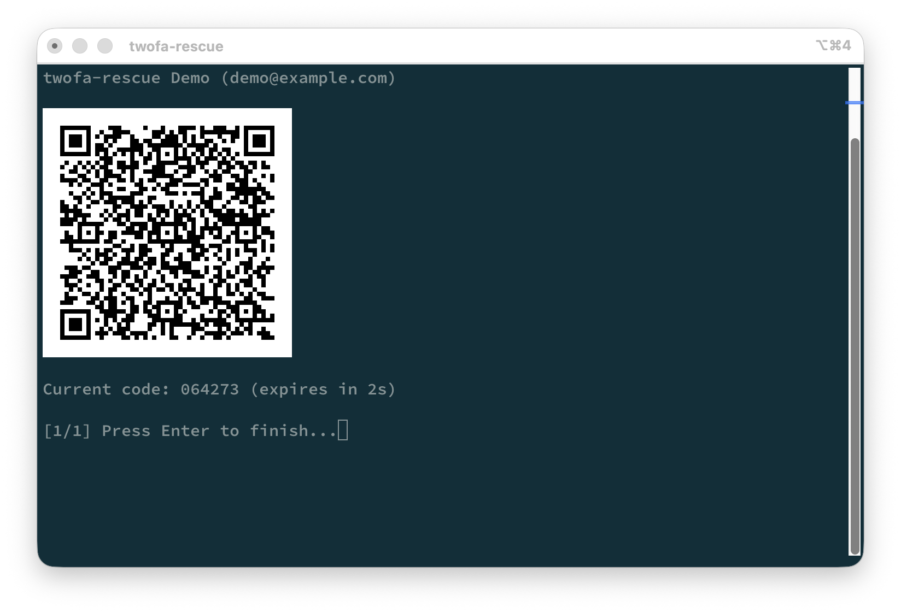<br />
      <sub>Demo QR code on iTerm2</sub>
    </td>
  </tr>
</table>

### Apple Terminal

This is a test on a junk 2012 13" MacBook Pro with Apple Terminal

<p align="center">
    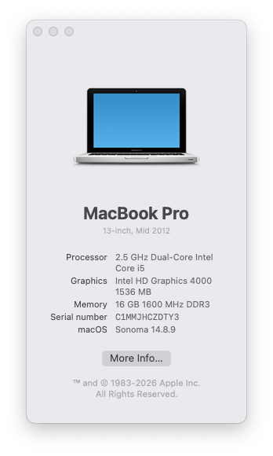
</p>

<table>
  <tr>
    <td align="center">
      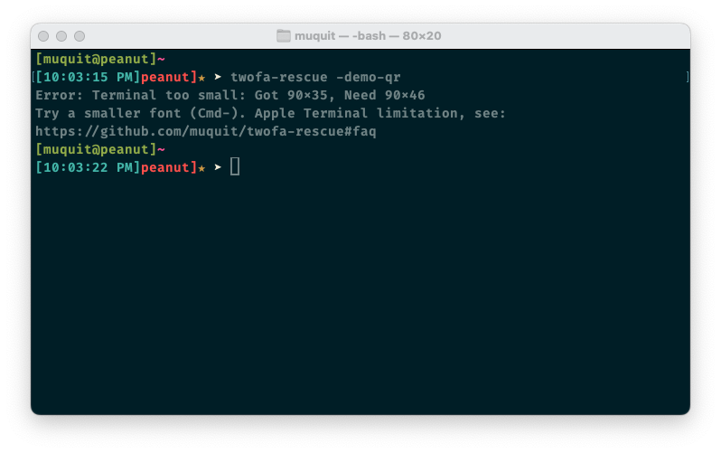<br />
      <sub>Demo QR code on an Apple Terminal, QR Code display failed</sub>
    </td>
  </tr>
</table>

- Above: with default font size, you will see the window will resize but will fail to display the QR Code. Note: this will not happen if you've a big enough screen.

<table>
  <tr>
    <td align="center">
      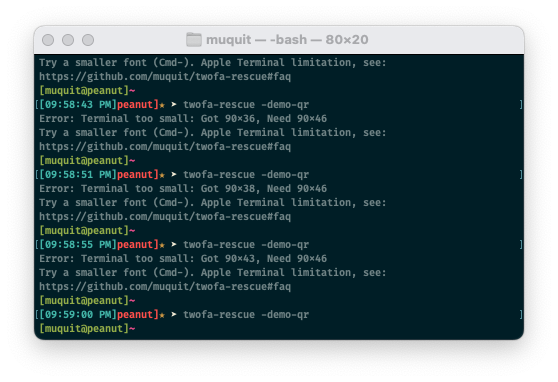<br />
      <sub>Demo QR code on on a an 13" macbook pro Apple Terminal</sub>
    </td>
  </tr>
</table>

- Notice Above: had to reduced font size 3 times by typing `Command-` and after that
the QR code was displayed successfully. Look at [FAQ](#faq) for details on
Apple Terminal limitations.

<table>
  <tr>
    <td align="center">
      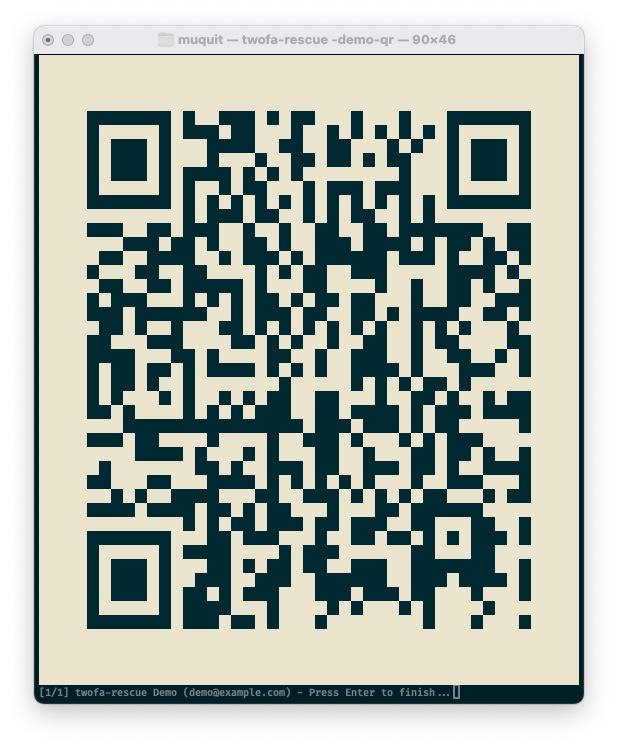<br />
      <sub>Demo QR code on on a an 13" macbook pro Apple Terminal</sub>
    </td>
  </tr>
</table>

- Expanded window with QR code


### Windows PowerShell

<table>
  <tr>
    <td align="center">
      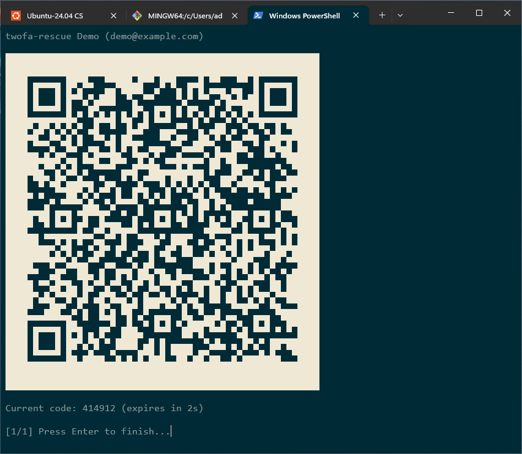<br />
      <sub>Demo QR code on on a Windows 11 Terminal</sub>
    </td>
  </tr>
</table>

Try any mobile 2FA app to test that 2FA secrets can be imported by scanning
the QR Code on the terminsl. I tested the following authenticator apps on iOS v26.6:

* [Google Authenticator](https://apps.apple.com/us/app/google-authenticator/id388497605)
* [Microsoft Authenticator](https://www.microsoft.com/en-us/security/mobile-authenticator-app)
* [Twilio Authy](https://www.authy.com/)
* [Ente Auth](https://ente.com/auth/) on iOS

## Show 2FA secret QR Code

Example on how to display QR Code with 2FA secrets. The displayed QR Code can
be used to import to other Authenticator Apps by scanning it with your camera
of your mobile device. 

Here it  is taking a sample encrypted [Ente Auth](https://ente.com/auth/) export JSON file as input. 
Example:

<table>
  <tr>
    <td align="center">
      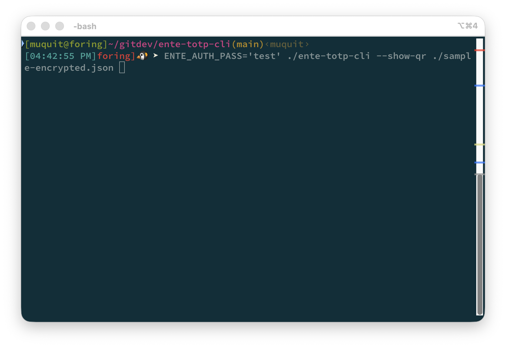<br />
      <sub>Command to display QRCode with 2FA secret</sub>
    </td>
  </tr>
</table>

<table>
  <tr>
    <td align="center">
      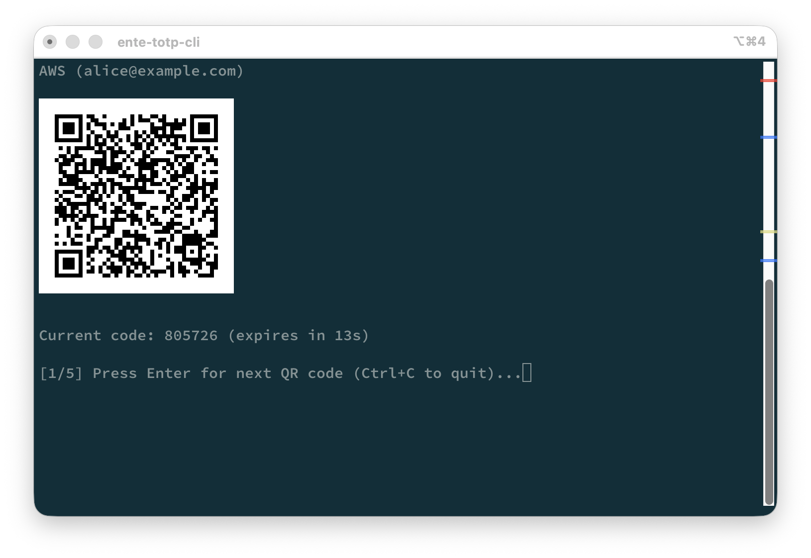<br />
      <sub>Display QR code of 2FA secret with code one by one. Can be imported by pointing camera of your Authenticator app</sub>
    </td>
  </tr>
</table>

The CLI uses a pure [go](https://go.dev/) implementation compatible with [libsodium](https://libsodium.org)'s
secretstream format for encryption and decryption.


# Tested Terminals

The following terminals displayed scannable QR codes in my tests. Other
terminals may work as well. If you test another terminal successfully, create
an issue and I will add it to the list.


|Terminal |OS |Result |Rendering|
|---|---|---|---|
| [iTerm2](https://iterm2.com/) | macOS | ✅ Works | [iTerm2 inline image protocol](https://iterm2.com/documentation-images.html) |
| [kitty](https://sw.kovidgoyal.net/kitty/) | macOS, Ubuntu 24.04 | ✅ Works | Unicode block fallback |
| [ghostty](https://ghostty.org/) | macOS | ✅ Works | Unicode block fallback |
| [WezTerm](https://wezterm.org/index.html) | macOS, Ubuntu, Windows | ✅ Works | Unicode block fallback |
| Apple Terminal | macOS | ✅ Works (auto-resizes the window if needed, see [FAQ](#faq)) | Solid ANSI block fill (custom) |
| Windows Terminal | Windows 11 Pro | ✅ Works | Unicode block fallback |
| GNOME Terminal | Ubuntu 24.04 | ✅ Works | Unicode block fallback |
| xterm | Ubuntu 24.04 | ✅ Works | Unicode block fallback |
| mlterm | Ubuntu 24.04 | ✅ Works | Unicode block fallback |
| foot | Ubuntu 24.04 | ✅ Works | Unicode block fallback |
| konsole | Ubuntu 24.04 (GNOME) | ✅ Works | Unicode block fallback |


Apple Terminal gets its own dedicated renderer (solid ANSI background-color
blocks, no font glyph involved), since testing showed the usual Unicode
block fallback comes out distorted no matter which font is
selected.

Every other terminal above, including ones that natively
support [Kitty graphics protocol](https://sw.kovidgoyal.net/kitty/graphics-protocol/) or [Sixel](https://en.wikipedia.org/wiki/Sixel), gets that same Unicode
block-character fallback. Where it says "✅ Works" for those, that means
the fallback happened to render a scannable QR code on that terminal's
default font, not that the tool used that terminal's own graphics
protocol.

Run with `--debug` to see which path was actually taken.


The testing was done as follows:

* Display demo QR Code

```
twofa-rescue --demo-qr
```

* Import the secret from the QR code using an app such as [Google Authenticator](https://apps.apple.com/us/app/google-authenticator/id388497605).
  After each successful import, delete the entry before testing it again in
  another terminal. I also tested other authenticator apps; see
  [Demo QR code](#demo-qr-code) for details.


# Encrypting files

This is a feature I added for myself, you may or may not need it. This can be
useful if do no use [Ente Auth](https://ente.com/auth/) but you know your 2FA secrets and want to 
create the encrypted JSON file similar to the one exported by [Ente Auth](https://ente.com/auth/) 
app. Please look at the FAQ.

Encrypt an input file, text or binary, into [Ente Auth](https://ente.com/auth/)'s JSON export
format, using the same Argon2id parameters [Ente Auth](https://ente.com/auth/)'s own app uses.
It works on any file, not just `otpauth://` lines. If the input is
`otpauth://` lines, the result is importable into the real [Ente Auth](https://ente.com/auth/)
app too, not just this tool.
```
twofa-rescue --encrypt -o encrypted.json plain.txt
```
**WARNING:** Anyone with the encrypted file and the password can decrypt
it. Treat `TWOFA_RESCUE_PASS` and the encrypted output with the same care
as the original secrets.


# Latest Version (v1.0.1)

The latest version is v1.0.1, released on Aug-15-2026. 
Please look at [ChangeLog.md](ChangeLog.md) for details.


# Testing

## Running tests

```
make test
```

This runs the full test suite. It takes about 10 seconds because one test uses
the real [Ente Auth](https://ente.com/auth/) Argon2id parameters.

You can also run the tests directly:

```
go test ./...
```

`crypt_test.go` tests the pure [go](https://go.dev/) implementation of
`crypto_secretstream_xchacha20poly1305` against output created by the real
[libsodium](https://libsodium.org) C library.

It checks:

* Ciphertext created by the real [libsodium](https://libsodium.org) library can be decrypted.
* Encrypting the same test data produces the expected [libsodium](https://libsodium.org) output.
* Encryption and decryption work with different message sizes.
* A wrong password is rejected.
* Corrupted ciphertext is rejected.
* The complete `--encrypt` and `--decrypt` commands work with a file on disk.

The tests found a padding bug while the code was being converted from cgo to
pure [go](https://go.dev/). The bug only affected messages whose length was not a multiple of 16
bytes.

See [ente-auth-export-encryption-algorithm-claude.md](https://github.com/muquit/twofa-rescue/blob/main/docs/ente-auth-export-encryption-algorithm-claude.md)
for details.


# FAQ

## Why did Apple Terminal.app resize when displaying a QR Code?

When QR codes are displayed with `--show-qr` or `--demo-qr`, Apple Terminal
resizes to accommodate the QR codes.

Apple Terminal.app does not support displaying images in the terminal. The CLI
draws the QR code using solid blocks instead.

This QR code needs more space than the default `80x24` window. If the window is
too small, the CLI asks Terminal.app to make it larger before displaying the
QR code. When you press Enter or Ctrl+C, it restores the old window size.

The resize request is an xterm control sequence. For example, this command asks
the terminal to resize to 40 rows and 100 columns:

```
printf '\e[8;40;100t'
```

If the window cannot be resized, the CLI will show the required size. Try a
smaller font with `Command-`, use a [better terminal](#tested-terminals), or use
`--export-qr` instead.

Use `--debug` to see which QR display method was selected.

To test the resize behavior, start with a small Apple Terminal window and run:

```
twofa-rescue --demo-qr
```

To test several entries in one session:

```
TWOFA_RESCUE_PASS=test twofa-rescue --show-qr sample-encrypted.json
```

## Why is the QR code distorted over ssh from Apple Terminal.app?

ssh does not forward the `TERM_PROGRAM` environment variable by default. The
CLI cannot detect Apple Terminal.app without it, so it uses the generic Unicode
block renderer.

Use `--debug` to confirm it. You will see something like:

```
[debug] TERM_PROGRAM="" TERM="xterm-256color": no known image protocol, using Unicode block fallback
```

There is no reliable way to detect Apple Terminal.app from `TERM` alone.
To test this idea, you can set `TERM_PROGRAM` for the remote command:

```
ssh remote_host TERM_PROGRAM=Apple_Terminal twofa-rescue --demo-qr
```

Make sure the local Terminal window is large enough for the QR code. Otherwise,
use a [better terminal](#tested-terminals) or use `--export-qr`.


## How can I try the CLI without a real Ente Auth export?

Use `sample-encrypted.json` from the repo. The password is `test`:

```
TWOFA_RESCUE_PASS=test twofa-rescue sample-encrypted.json
```

The file contains fake accounts such as `alice@example.com`. To import only one into
an authenticator app using a QR code, use the filter `github`:

```
TWOFA_RESCUE_PASS=test twofa-rescue --show-qr sample-encrypted.json github
```

## Can I use the CLI without a real encrypted Ente Auth export?

Yes it's possible. If you know your 2FA secrets, you can create a text 
file like `sample-otpauth-urls.txt`, update account, issuer etc accordingly.
e.g.

```
otpauth://totp/GitHub:alice@example.com?secret=JBSWY3DPEHPK3PXP&issuer=GitHub
```

Then use the `--encrypt` option create a JSON file with encrypted secret.

Example:

```
TWOFA_RESCUE_PASS=yourpassword twofa-rescue --encrypt \
    -o myexport_encrypted.json plaintext_json.txt
```

## Why did Windows block the binary with "An Application Control policy has blocked this file"?

In File Explorer, right-click the binary > Properties > General tab.
If there's an "Unblock" checkbox near the bottom, check it and try running again.

On a personal Windows 11 system, this is likely Smart App Control (SAC), 
 which uses Microsoft's cloud reputation service and code signatures
to decide whether to trust an app. The Windows build of `twofa-rescue` isn't
currently signed, so a new or uncommon build can get flagged.

In my case, several freshly cross-compiled binaries were blocked at first. About
ten minutes after transferring another build, all of the previously-blocked
binaries started running without any changes on my end, likely a delayed
reputation check or a local security definition update. Waiting and retrying
may help, but it's not guaranteed.


## Why did I not abandon Ente Auth after the bug that motivated this CLI?

There are a few reasons. I am familiar with the crypto [Ente Auth](https://ente.com/auth/) uses to
encrypt the exported JSON file. It uses Argon2id for key derivation and
libsodium's `crypto_secretstream_xchacha20poly1305` for encryption. I trust the
encrypted file enough to keep copies on all my systems. Of course, this 
assumes the export is protected with a strong passphrase.

I also live in terminals. If my phone is upstairs, I do not want to go get it
just for a 2FA code.

Most importantly, I can decrypt the export myself and import the secrets into
another Authenticator app whenever I want. I still use [Ente Auth](https://ente.com/auth/), but I am no
longer dependent on it or any other single Authenticator app.


# License (MIT)

MIT. See the [LICENSE.txt](LICENSE.txt) file for details.

# Credits

* Mostly developed with assistance from [Claude Code](https://claude.com/claude-code). I reviewed every line
of code and cleaned up.

* QR codes generated from the [Ente Auth](https://ente.com/auth/) encrypted export did not work with
[Google Authenticator](https://apps.apple.com/us/app/google-authenticator/id388497605). They worked with [Microsoft Authenticator](https://www.microsoft.com/en-us/security/mobile-authenticator-app), [Twilio Authy](https://www.authy.com/) and
[Ente Auth](https://ente.com/auth/). [Codex](https://openai.com/codex) fixed the problem.

* [Codex](https://openai.com/codex) also made QR codes fit in Apple Terminal with a 12-point font on my
old 13-inch MacBook Pro. Previously I had to use an 8-point font.

* [Claude Code](https://claude.com/claude-code)'s notes on how the [Ente Auth](https://ente.com/auth/) encrypted export format
works: [ente-auth-export-encryption-algorithm-claude.md](docs/ente-auth-export-encryption-algorithm-claude.md)

* Docs were cleaned up by [Codex](https://openai.com/codex).

* `scripts/mk_release_notes.sh` was made generic by [Codex](https://openai.com/codex)


---
<sub>TOC/glossary expansion by https://github.com/muquit/markdown-toc-go v1.0.6 on Aug-27-2026</sub>
